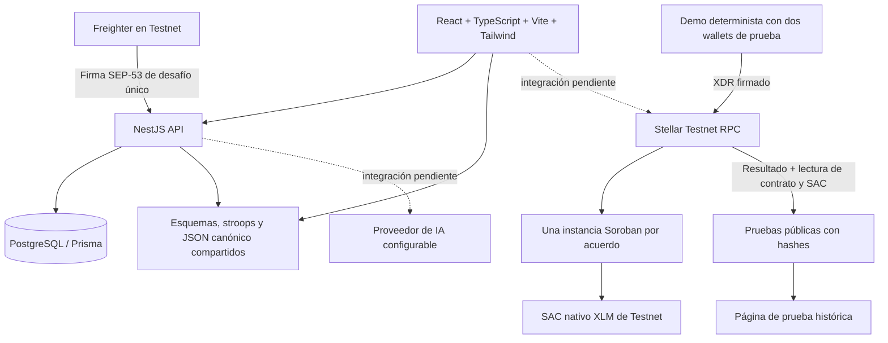
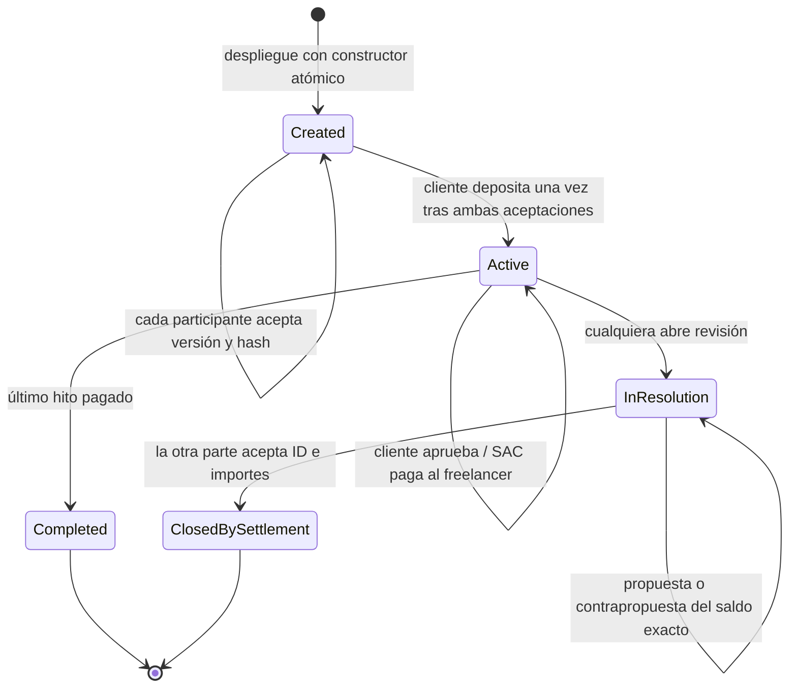

# Arquitectura y flujo

La autoridad financiera está en `contracts/escrow`, con `require_auth` y chequeos de estado dentro del contrato. Las transferencias SAC y las escrituras de estado se ejecutan en una única invocación atómica. El token no se recibe como argumento: es el SAC XLM fijo de Testnet. El constructor también verifica el ID de red derivado de la passphrase de Testnet.

PostgreSQL conserva el índice y datos privados. Las columnas monetarias usan BIGINT en stroops; la API envía cadenas. La migración convierte los DECIMAL XLM existentes multiplicando por 10.000.000 y aborta ante desbordamiento. No existe saldo confirmado solo porque un registro diga `Funded` o un usuario envíe un hash.

Las antiguas transiciones que confirmaban pagos en la base de datos se retiraron. Los endpoints financieros tienen una barrera explícita de etapa, tanto en controlador como en servicio, hasta implementar preparación, firma, envío y reconciliación por contrato. No existe una variable de entorno para saltar esa barrera.

Autenticación: desafío aleatorio de 256 bits, texto con origen/red/wallet/expiración, duración de cinco minutos, firma SEP-53 y consumo mediante UPDATE condicional en PostgreSQL. Un único solicitante puede consumirlo. JWT de una hora con secreto obligatorio. Esta primera etapa admite claves Ed25519 de cuentas G; no implementa la política multifirma de una cuenta Stellar ni smart wallets. Los pagos mantienen la autorización real de Soroban.

Contrato: almacenamiento persistente para el acuerdo y huellas históricas; extensión de TTL a unos 30 días por actividad. `maintain` no concede permisos ni libera fondos. El archivado exige restaurar estado/código según RPC; nunca recrear un acuerdo archivado como vacío. Véase `testnet.md`.
